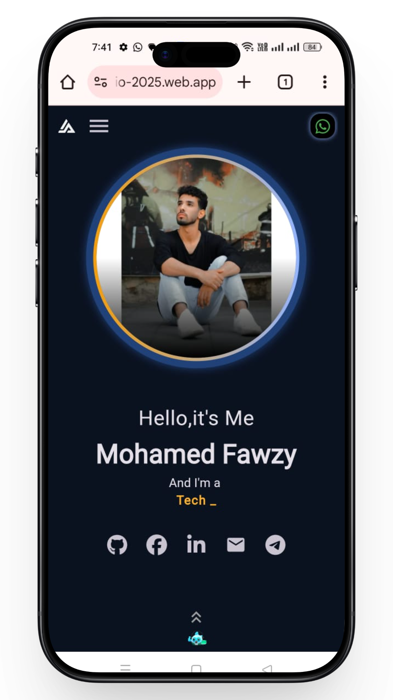
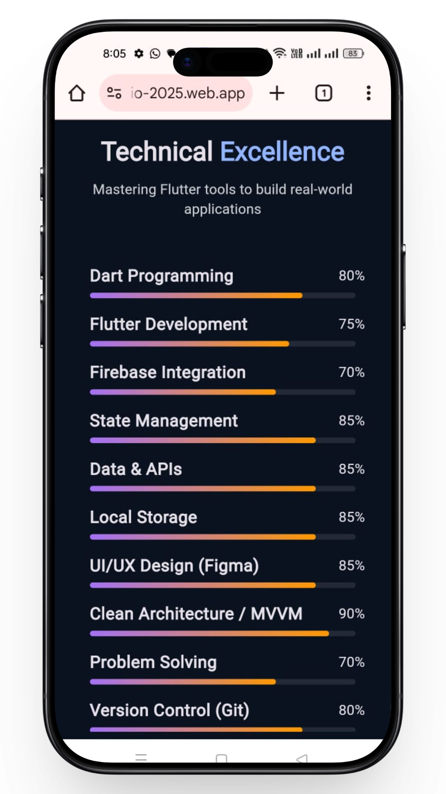
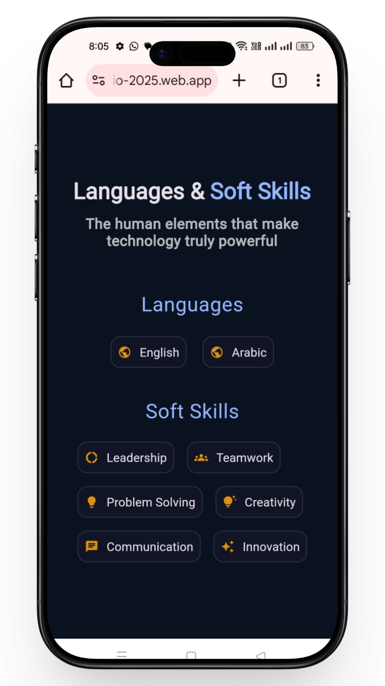
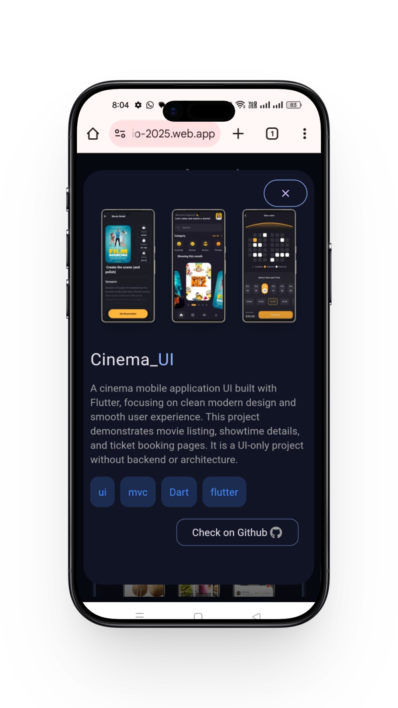
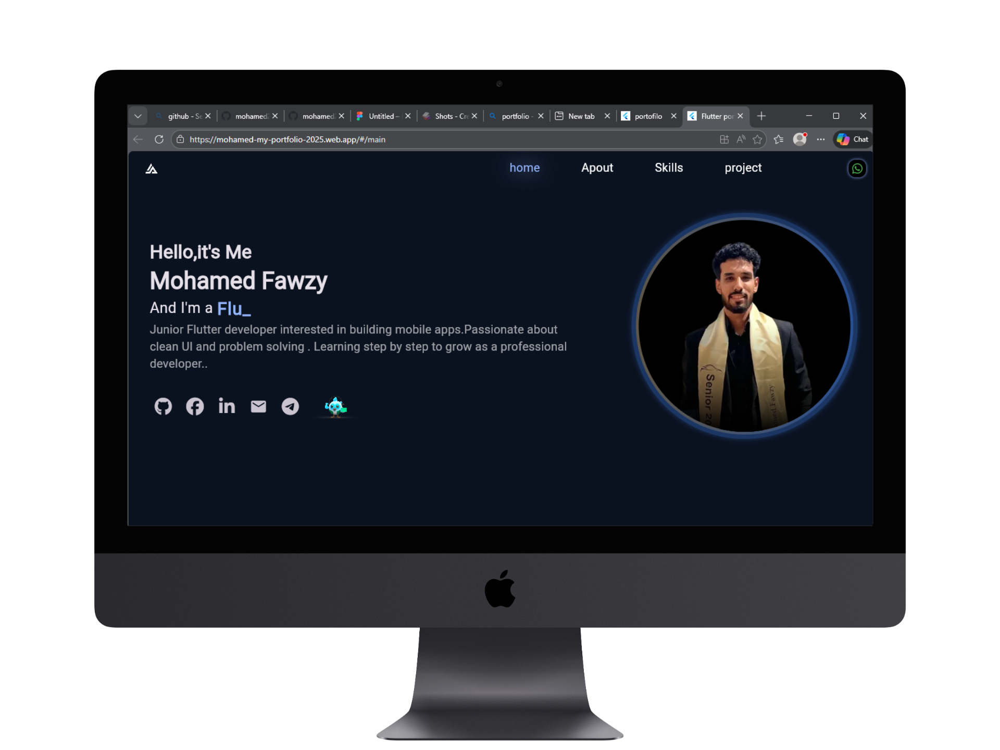
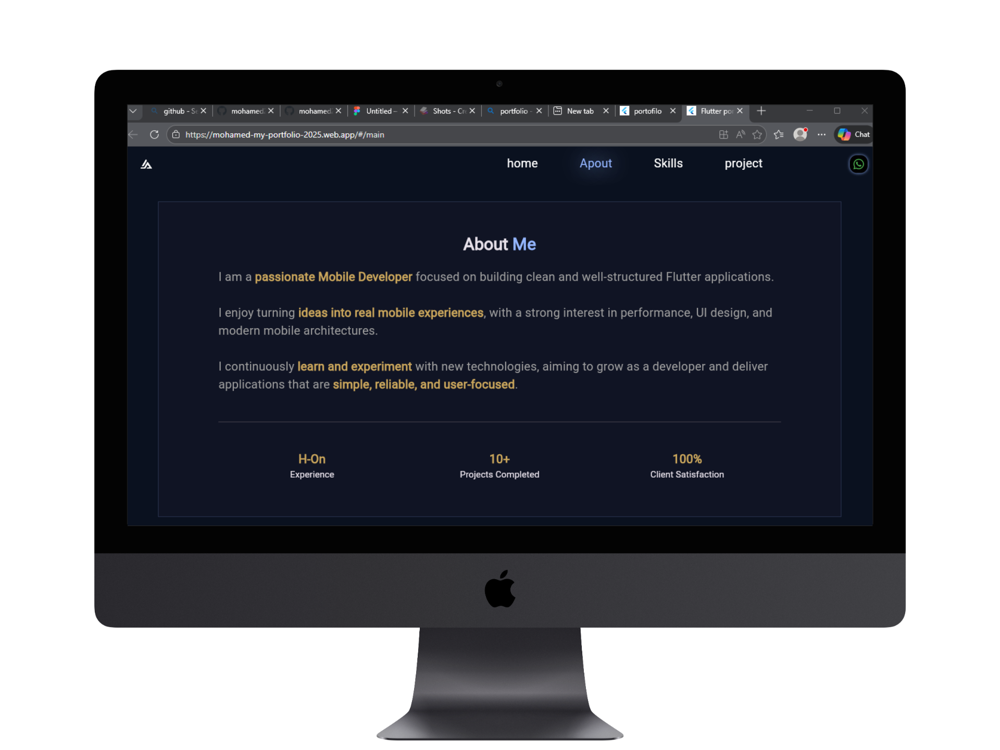
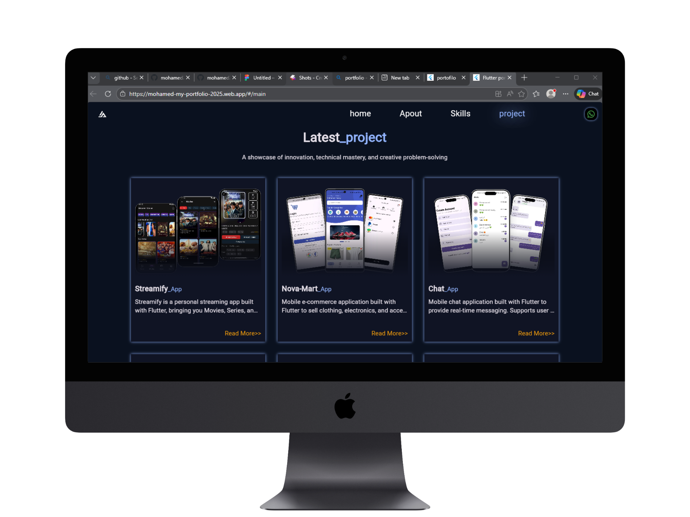

# 🌐 Flutter Web Portfolio

A modern **Flutter Web portfolio** built to showcase projects and skills with a strong focus on **performance, bundle size optimization, and smooth user experience**.  
The project is fully **responsive & adaptive**, enhanced with animations, and uses **Navigation 2.0** for clean and scalable routing.

---

## 📌 Overview

This portfolio website was built using **Flutter Web** to demonstrate how Flutter can be used to create **high-performance web applications** with modern UI and smooth interactions.  
Special attention was given to **reducing bundle size**, optimizing rendering, and ensuring fast load times across devices.

---
 ## 📸 Screenshots
<table>
<tr>
  <td></td>
  <td></td>
  <td></td>
  <td></td>
</tr>
</table> 
<table>
<tr>
  <td></td>
  <td></td>
  <td></td>
</tr>
</table>

## ✨ Features
- 🌐 **Flutter Web Portfolio**
- 🧭 **Navigation 2.0** for declarative routing
- 📱 **Responsive & Adaptive UI** (Desktop / Tablet / Mobile)
- 🎬 **Smooth Animations & Transitions**
- ⚡ **Performance Optimized**
- 📦 **Reduced Bundle Size**
- 🧼 **Clean & Maintainable Code**
- 🎨 Modern and minimal design

---

## 🛠 Tech Stack
- **Flutter Web**
- **Dart**
- **Navigation 2.0**
- **Responsive & Adaptive Layouts**
- **Custom Animations**
- **Performance Optimization Techniques**

---

## 🧭 Navigation
- Implemented using **Navigation 2.0**
- Declarative and scalable routing
- Better control over browser navigation and deep linking

---

## 🎯 Responsive & Adaptive Design
- Layouts adapt smoothly to different screen sizes
- Optimized UI for desktop, tablet, and mobile
- Flexible widgets and breakpoints for better UX

---

## ⚡ Performance & Bundle Optimization
- Minimized widget rebuilds
- Optimized asset usage
- Lazy loading where possible
- Clean widget tree structure
- Focus on fast initial load and smooth scrolling

---

## 🎬 Animations
- Subtle and meaningful animations
- Improved user engagement without performance cost
- Smooth transitions between sections

---

## 🎯 Purpose
Built to:
- Showcase Flutter Web capabilities
- Create a **portfolio-ready web application**
- Practice performance optimization techniques
- Demonstrate responsive & adaptive UI design

---

## 📄 License
Open source — free to use for learning and inspiration.
